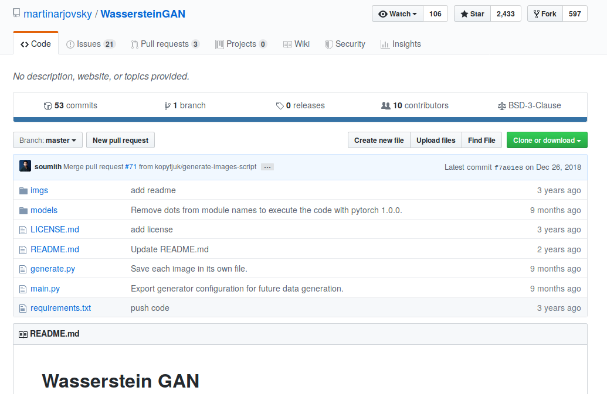
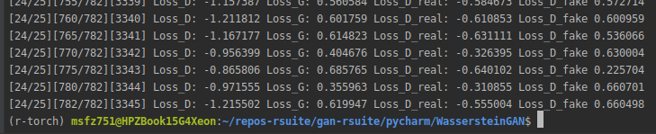
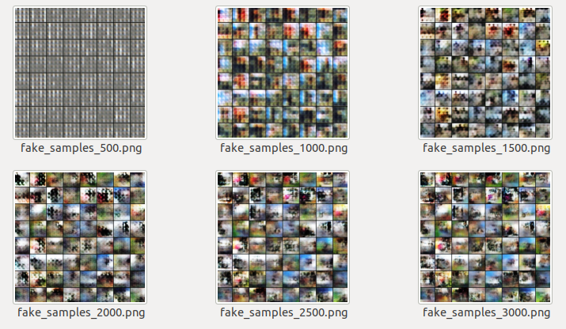

# WassersteinGAN

[TOC]

## Purpose

PyTorch code accompanying the paper ["Wasserstein GAN"](https://arxiv.org/abs/1701.07875).

The code is structured so it can be called from the command line. It has two scripts: `main.py` and `dcgan.py` where the networks are defined. From user input, the script can download three datasets: `cifar10`, `lsun`, `imagenet`. There are plenty of parameters that could be set from the terminal such as batch size, dimension of the image, number of epochs. learning rate, iterations, number of GPUs, etc.

## Status 

Running after some modifications to the original code.

>  Originally not running with CPU.


## Code

https://github.com/martinarjovsky/WassersteinGAN/blob/master/main.py#L163-L166

## Paper

Code accompanying the paper ["Wasserstein GAN"](https://arxiv.org/abs/1701.07875)

## Repo screenshot




## CIFAR10

### command

```
python main.py --dataset cifar10 --dataroot "./cifar10" --ngpu=0 --cpu --experiment="./out"
```


### Screenshot of output




### Screenshot of images at the end

