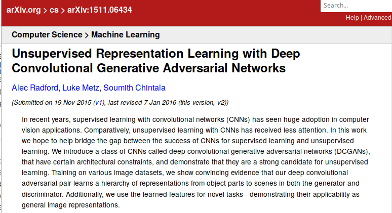
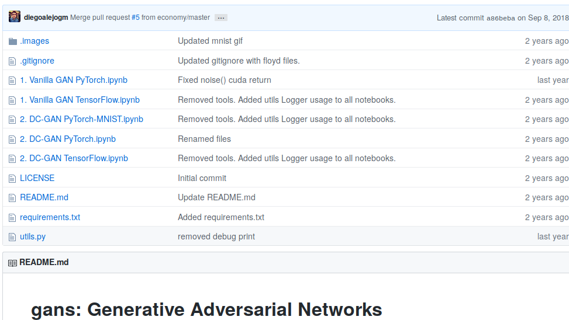
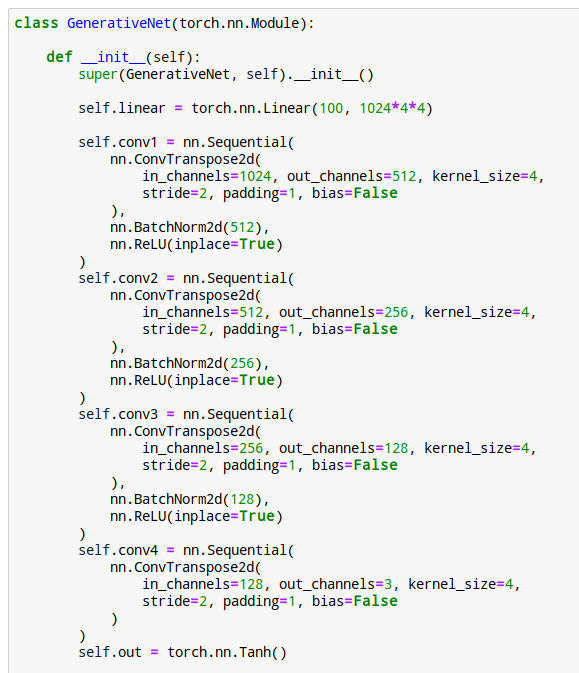
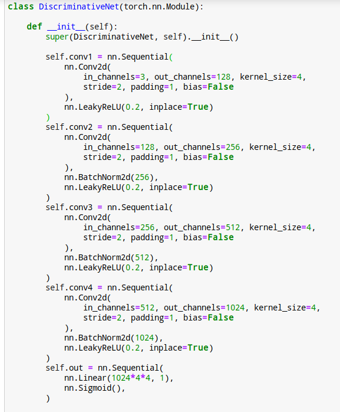

# Deep Convolutional GAN

[TOC]

## Objective

Run Deep Convolutional GAN based on CIFAR dataset.

## Paper

* https://arxiv.org/abs/1511.06434

* 

## Screenshots

### Repo

### Generator

### Discriminator

DC: Deep Convolutional

## Sources

### GitHub

https://github.com/diegoalejogm/gans/blob/master/2.%20DC-GAN%20PyTorch.ipynb