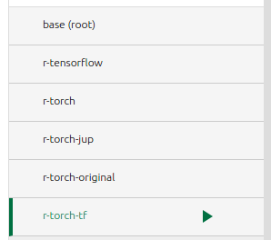
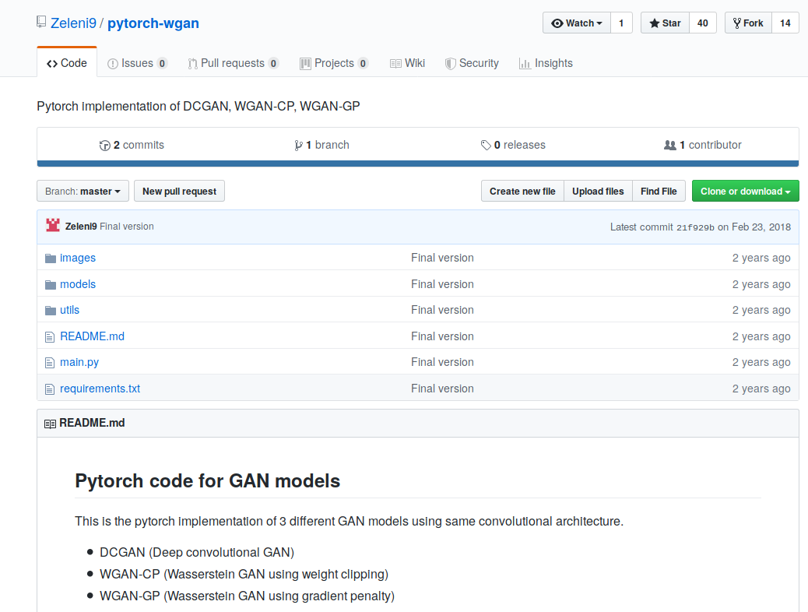

# gan-3

[TOC]

## Objective

It addresses three different kind opf GANs.

Requires creating a special environment for this project: `r-torch-tf`.

## Status

Not running. Problem with running with CPU; only runs with GPU.

Several changes made to fix CPU issue. One of the problems is that makes validation of CUDA at different locations in the code.

## Sources

### Github

https://github.com/Zeleni9/pytorch-wgan

### Screenshot

## *Useful Resources*

- [WGAN reddit thread](https://www.reddit.com/r/MachineLearning/comments/5qxoaz/r_170107875_wasserstein_gan/)
- [Blogpost](https://lilianweng.github.io/lil-log/2017/08/20/from-GAN-to-WGAN.html)
- [Deconvolution and checkboard Artifacts](https://distill.pub/2016/deconv-checkerboard/)
- [WGAN-CP paper](https://arxiv.org/pdf/1701.07875.pdf)
- [WGAN-GP paper](https://arxiv.org/pdf/1704.00028.pdf)
- [DCGAN paper](https://arxiv.org/pdf/1511.06434.pdf)
- [Working remotely with PyCharm and SSH](https://medium.com/@erikhallstrm/work-remotely-with-pycharm-tensorflow-and-ssh-c60564be862d)

