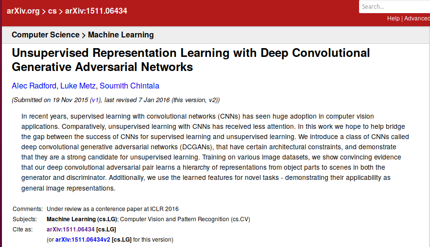

# lsun-dcgan

[TOC]


## Objective

This example implements the paper [Unsupervised Representation Learning with Deep Convolutional Generative Adversarial Networks](http://arxiv.org/abs/1511.06434).

Makes use of the command line to define the parameters of the model. It works on GPU and CPUs.


## Status

Running with own datasets. Big datasets are not recognized.


```
python main.py --dataset  mnist --dataroot "./out-mnist"
```


## Paper



The implementation is very close to the Torch implementation [dcgan.torch](

## Sources

### Github
https://github.com/pytorch/examples/blob/master/dcgan/README.md

### Article

https://www.yf.io/p/lsun

## Datasets

You can download the LSUN dataset by cloning [this repo](https://github.com/fyu/lsun) and running

```
python download.py -c bedroom
```

