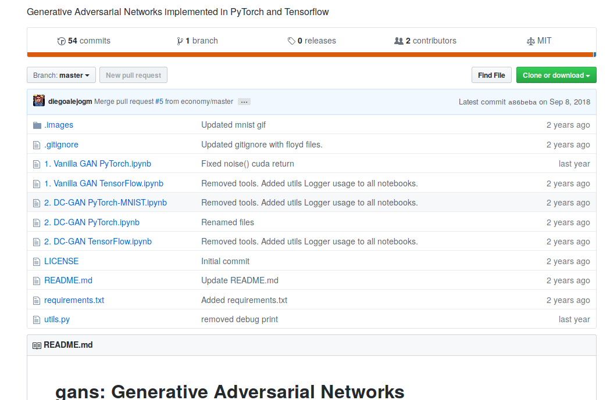

# mnist_gan

[TOC]

## Objective
Run standard code for Generative Adversarial Networks (GAN). Running from a Python script and a Jupyter notebook.

## Dataset

MNIST digits

## Source

GitHub repo with a collection of notebook on GANs.

### Notebook

https://github.com/diegoalejogm/gans/blob/master/1.%20Vanilla%20GAN%20PyTorch.ipynb

### Article
https://medium.com/ai-society/gans-from-scratch-1-a-deep-introduction-with-code-in-pytorch-and-tensorflow-cb03cdcdba0f

### Code
https://github.com/diegoalejogm/gans

### Screenshot repo

## Dependencies

* Python package `tensorboardX`
* Local script `utils.py`
* Not necessary to create folders for data or output. If data not available it will download from site.
* Runs in Python 3.6

## Observations

* It takes more than an hour to run all epochs and batches.
* Running it from the notebook shows the progression of images as the algorithm iterate through epochs and batches.
* Running the script does not show images in real time. The images are saved automatically in the folder `data`.

## Fixes, errors

* Script did not originally run because had a problem with loading the dataset in function `mnist_data()`. Fixed temporarily by removing compose.