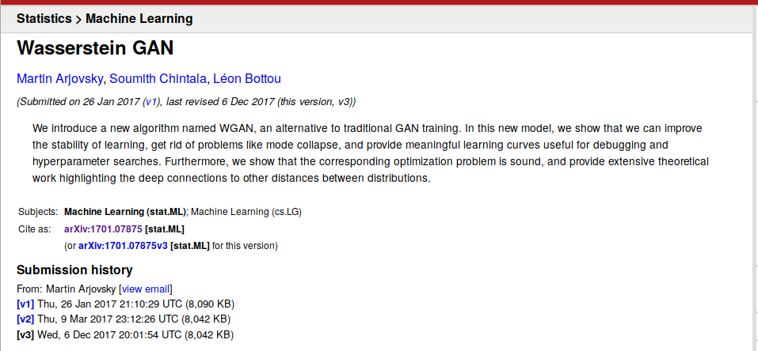
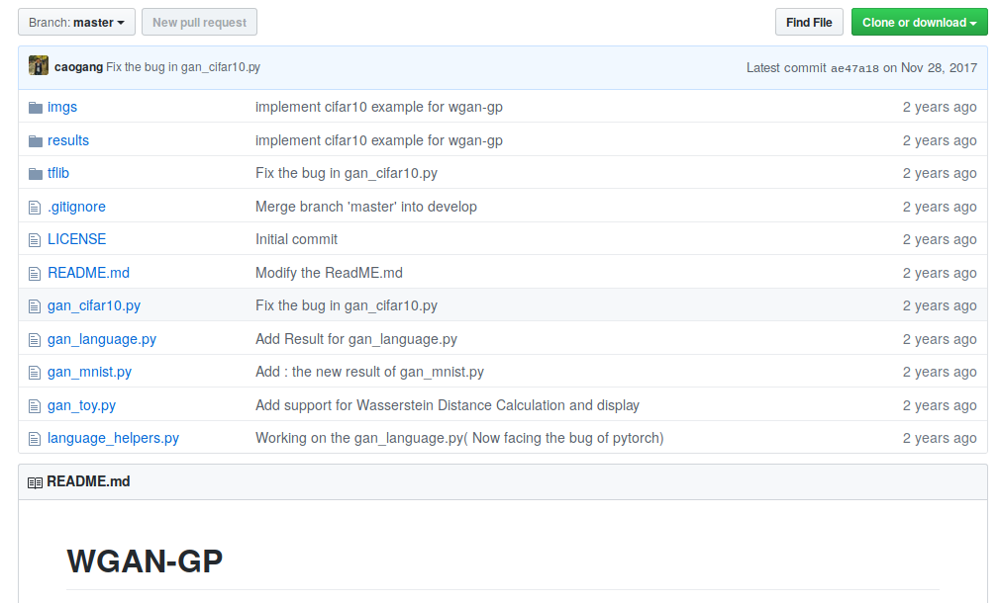
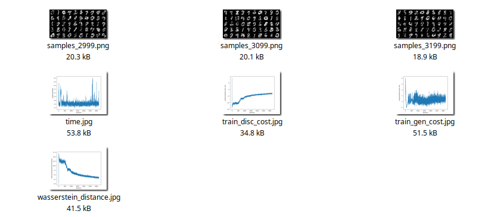
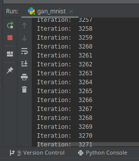
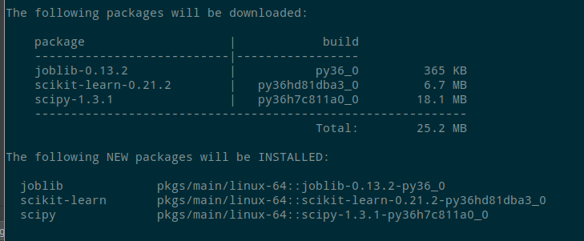

# mnist-wgan-gp

[TOC]

## Objective

Run a Wasserstein GAN with PyTorch. Uses dataset MNIST digits.


## Paper

Based on paper "Wasserstein GAN" by Martin Arjovsky, Soumith Chintala, Léon Bottou.

https://arxiv.org/abs/1701.07875




## Source

Based on:

1. https://github.com/martinarjovsky/WassersteinGAN
2. https://github.com/igul222/improved_wgan_training


### Code

https://github.com/caogang/wgan-gp

```
https://github.com/caogang/wgan-gp
```


## Dataset


## Screenshots

### repo



### saved images in real time



### Iterations

Screenshots taken at iteration 3260



## Dependencies

### output folder

Create the folder `./tmp/mnist` first for the output files.

### imageio

```
# activate r-torch environment first
conda install imageio
```


### scikit-learn

```
(r-torch) datascience@ubuntu-zbook15G2:~$ 
conda install scikit-learn
```





## Fixes and errors

* Get rid of warnings by removing `volatile=True`
* Fix `urllib.request.urlretrieve(url, filepath)` by adding method `request`.
* Fix issues with dictionaries in 3.7. Add `list()` to couple of commands under loop `for name, vals in _since_last_flush.items():` in `plot.py`.
* add `encoding='latin1'` to `pickle.load`
* Force couple of calculations to integer

* Replace cPickle

* add folder `./tmp/mnist`. Otherwise, saving images fail

* Fix Python 2.7 print() problem in scripts.
* Replace `xrange` with `range`
* Install Python packages `imageio`
* Use `r-torch` as the interpreter environment