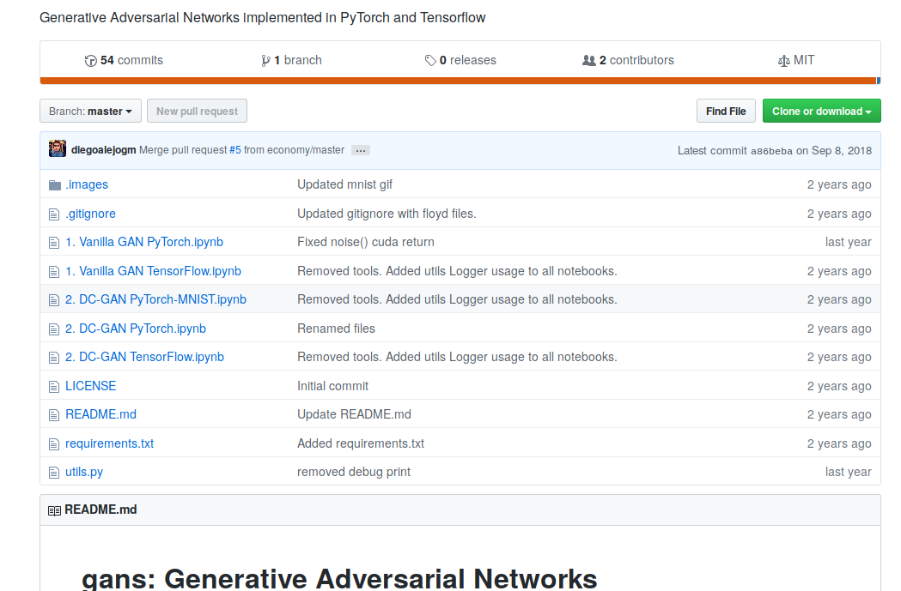

# mnist_gan

[TOC]

## Objective
Run standard code for Generative Adversarial Networks (GAN). Running from a Python script and a Jupyter notebook.

## Source
* https://github.com/diegoalejogm/gans/blob/master/1.%20Vanilla%20GAN%20PyTorch.ipynb
* GitHub repo with a collection of notebook on GANs.

## Dependencies

* Python package `tensorboardX`
* Local script `utils.py`
* Not necessary to create folders for data or output. If data not available it will download from site.

## Observations

* Running it from the notebook shows the progression of images as the algorithm iterate through epochs and batches.
* Running the script does not show images in real time. The images are saved automatically in the folder `data`.
* 